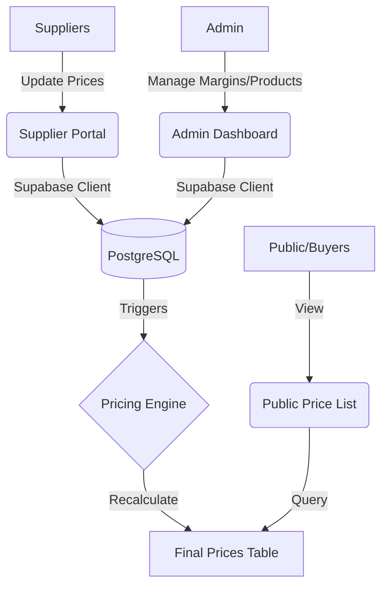

# 🏷️ Afrisale Pricing Engine

Afrisale Pricing Engine is a real-time price aggregation and management system designed to replace manual spreadsheet-based workflows. It allows multiple suppliers to submit prices independently, automatically identifies the lowest available price, applies configurable margins, and generates a live master price list for public or internal use.

---

## 🚀 Key Features

### 🏢 Supplier Portal
- **Zero-Password Access**: Suppliers log in via unique, secure token links.
- **Independent Pricing**: Suppliers can only see and update prices for products assigned to them.
- **Real-time Persistence**: Price updates are saved instantly and trigger the pricing engine.

### 🛠️ Admin Dashboard
- **Consolidated View**: A single table displaying all supplier prices side-by-side.
- **Lowest Price Highlighting**: Automatically identifies the current "best" price per product.
- **Granular Margin Control**: Set global or per-product margins (Percentage or Fixed).
- **Price Overrides**: Manually override calculated prices for strategic adjustments.
- **Product & Supplier Management**: Full CRUD capabilities for products and suppliers.

### ⚙️ Automated Pricing Engine
- **Instant Calculation**: Final prices update within seconds of any supplier or config change.
- **Materialized Results**: Uses PostgreSQL triggers and functions for high-performance price derivation.
- **Fallback Logic**: Intelligent defaults for margin and pricing configuration.

### 🌐 Public Master Price list
- **Live Updates**: A public-facing view that always reflects the latest authorized prices.
- **Privacy-First**: Automatically hides internal supplier data, margins, and cost prices.

---

## 💻 Tech Stack

- **Framework**: [Next.js 16 (App Router)](https://nextjs.org/)
- **Database & Auth**: [Supabase](https://supabase.com/) (PostgreSQL + Auth)
- **Styling**: [Tailwind CSS 4](https://tailwindcss.com/)
- **Animations**: [Framer Motion](https://www.framer.com/motion/)
- **Icons**: [Lucide React](https://lucide.dev/)
- **Deployment**: [Vercel](https://vercel.com/)

---

## 🏗️ Project Architecture



### Directory Structure
- `src/app/admin`: Admin dashboard routes and components.
- `src/app/portal`: Supplier-facing portal with token-based access.
- `src/app/gate`: Authentication and entry logic.
- `src/lib`: Supabase clients and shared utility functions.
- `supabase/`: SQL migrations and schema definitions.

---

## 🛠️ Getting Started

### 1. Prerequisites
- **Node.js** (v20 or later)
- **pnpm** (recommended)
- **Supabase Account**

### 2. Environment Setup
Create a `.env.local` file in the root directory:
```bash
NEXT_PUBLIC_SUPABASE_URL=your-project-url
NEXT_PUBLIC_SUPABASE_ANON_KEY=your-anon-key
SUPABASE_SERVICE_ROLE_KEY=your-service-role-key # Used for admin actions
```

### 3. Database Initialization
Run the schema script located in `supabase/schema.sql` within your Supabase SQL Editor to set up:
- Tables for Products, Suppliers, and Prices.
- The `recalculate_price` PostgreSQL function.
- Automating triggers for price updates.

### 4. Installation & Development
```bash
# Clone the repository
git clone https://github.com/rkayg/afrisale-price-aggregation-engine.git

# Install dependencies
pnpm install

# Start the development server
pnpm dev
```

Open [http://localhost:3000](http://localhost:3000) to view the portal.

---

## 📊 Database Schema Highlights

The system uses a highly normalized schema with specialized tracking:
- **`products`**: Central registry with reference numbers (`ref_no`).
- **`suppliers`**: Stores supplier metadata and access tokens.
- **`supplier_prices`**: The core mapping of supplier-to-product costs.
- **`pricing_config`**: Stores margins (percentage/fixed) and manual overrides.
- **`final_prices`**: A materialized view of the calculated results for fast retrieval.

---

## 📜 License

Internal Project - All Rights Reserved.
